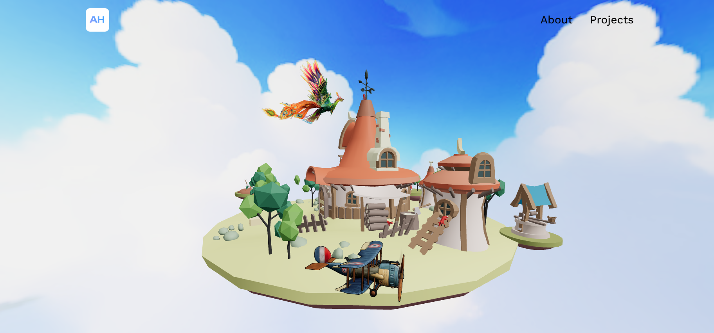

# 3D Airplane Portfolio Website

## Welcome! 👋

## Table of contents

- [Overview](#overview)
  - [The challenge](#the-challenge)
  - [How to setup the project](#how-to-setup-the-project)
  - [Screenshot](#screenshot)
  - [Links](#links)
- [How to run](#how-to-run)
- [How to build](#how-to-build)
- [How to preview the build](#how-to-preview-the-build)
- [How to host](#how-to-host)
- [My process](#my-process)
  - [Built with](#built-with)
  - [What I learned](#what-i-learned)
  - [Continued development](#continued-development)
  - [Useful resources](#useful-resources)
- [Author](#author)
- [Acknowledgments](#acknowledgments)

## Overview

### The challenge

Users should be able to:

- Explore a gamified portfolio website with an airplane flying around an island.
- View checkpoints with information about me.
- Experience an interactive layout where they can control the plane using arrow keys.
- Access separate pages showcasing the about section and past projects.
- Enjoy a responsive design for both PC and mobile devices.

### How to setup the project

To set up the project locally, follow these steps:

1. Clone the repository using GitHub Desktop or Git Bash:
   ```bash
   git clone https://github.com/SartHak-0-Sach/3d_airplane_portfolio_website.git
   ```
2. Navigate to the project directory:
   ```bash
   cd 3d_airplane_portfolio_website
   ```

### Screenshot



### Links

- Solution URL: [Link to this repo](https://github.com/SartHak-0-Sach/3D_airplane_portfolio_website)
- Live Site URL: [Live site URL](https://3d-game-portfolio-website.vercel.app/)

## How to run

Note: You need Node.js and npm installed on your machine.

```bash
npm install
npm run dev
```

## How to build

```bash
npm run build
```

A `dist` folder should be created.

## How to preview the build

```bash
npm run preview
```

## How to host

Here is a guide: [How to deploy the project](https://github.com/SartHak-0-Sach/2D-game_portfolio-website/blob/main/HOW_TO_DEPLOY.MD)

## My process

### Built with

- Three.js
- React
- Tailwind CSS
- TypeScript
- Vite

### What I learned

Working on this project allowed me to explore advanced 3D rendering techniques with Three.js and deepen my understanding of React and TypeScript.

Here is a code snippet that I am proud of-

```jsx
function addAnimation() {
    if (containerRef.current && scrollerRef.current) {
      const scrollerContent = Array.from(scrollerRef.current.children);

      scrollerContent.forEach((item) => {
        const duplicatedItem = item.cloneNode(true);
        if (scrollerRef.current) {
          scrollerRef.current.appendChild(duplicatedItem);
        }
      });

      getDirection();
      getSpeed();
      setStart(true);
    }
  }
  const getDirection = () => {
    if (containerRef.current) {
      if (direction === "left") {
        containerRef.current.style.setProperty(
          "--animation-direction",
          "forwards"
        );
      } else {
        containerRef.current.style.setProperty(
          "--animation-direction",
          "reverse"
        );
      }
    }
  };
  const getSpeed = () => {
    if (containerRef.current) {
      if (speed === "fast") {
        containerRef.current.style.setProperty("--animation-duration", "20s");
      } else if (speed === "normal") {
        containerRef.current.style.setProperty("--animation-duration", "40s");
      } else {
        containerRef.current.style.setProperty("--animation-duration", "80s");
      }
    }
  };
```

### Continued development

I aim to enhance my skills in 3D graphics and animation, and further integrate advanced interactivity features in web projects to create engaging user experiences.

### Useful resources

- [Three.js Documentation](https://threejs.org/docs/) - Essential for learning about 3D graphics and rendering.
- [React Documentation](https://reactjs.org/docs/getting-started.html) - Comprehensive guide to React.
- [Tailwind CSS Documentation](https://tailwindcss.com/docs) - Great resource for utility-first CSS framework.
- [TypeScript Documentation](https://www.typescriptlang.org/docs/) - Documentation for TypeScript programming language.
- [Vite Documentation](https://vitejs.dev/guide/) - Guide to Vite, a build tool.

## Author

<b><strong>Sarthak Sachdev</strong></b>
- Website - [Sarthak Sachdev](https://itsmesarthak.netlify.app/)
- LeetCode - [@sarthak_sachdev](https://leetcode.com/u/sarthak_sachdev/)
- Twitter - [@sarthak_sach69](https://www.twitter.com/sarthak_sach69)

## Acknowledgments

Special thanks to the vast knowledge base available on YouTube and Stack Overflow, where I learned many of the concepts and got my doubts cleared.

## Got feedback for me?

I love receiving feedback! I am always looking to improve my code and take up new innovative ideas to work upon. So if you have anything you'd like to mention, please email 'hi' at saarsaach30[at]gmail[dot]com.

If you liked this project, make sure to spread the word and share it with all your friends.

**Happy coding!** ☺️🚀
